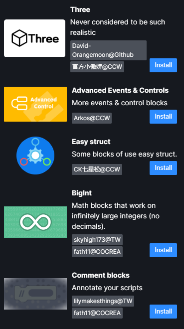

# Ensuring compatibility with Gandi IDE

Gandi IDE and Turbowarp's extension format aren't that different from each other;
So, a completely new tutorial for both is optional.
However theres still a few differences that may break the compatibility, so make sure you read entire documentation before making your extension.

---

## Extension info (aka Metadata)

Gandi IDE supports `Scratch.extensions.register()`. But it also has its own metadata format (without these metadata your code can't be contributed to the Gandi repository).

In order to load your extension by official extension loader, you need to provide something like:

```js
Reflect.set(window, 'tempExt', {
  Extension: YourExtensionClass, // replace it with your own extension class here.
  info: {
    name: 'NamespaceOfyourExtension.name', // replace NamespaceOfyourExtension with your extension's namespace here (namespace is usually the name of your extension, like lpp).
    description: 'NamespaceOfyourExtension.desc',
    extensionId: 'NameOfyourExtension', // ID of the extension. Usually the name of your extension but please only use letters.
    featured: true,
    disabled: false,
    collaborator: 'You!' // replace it with your name here.
    collaboratorURL: 'https://github.com/FurryR' // Optional but recommended. Replace it with your own profile or blog URL.

    // The following options are used if there are multiple collaborators. Don't use collaborator and collaboratorList while using collaboratorList!
    collaboratorList: [
      {
        collaborator: 'FurryR@GitHub',
        collaboratorURL: 'https://github.com/FurryR'
      },
      {
        collaborator: 'Fath11@Cocrea',
        collaboratorURL: 'https://cocrea.world/@Fath11'
      },
      {
        collaborator: 'VeroFess@GitHub',
        collaboratorURL: 'https://github.com/VeroFess'
      }
    ]
  },
  // CCW doesn't support languages like ja-jp, so we do not need to add other translations.
  l10n: {
    'zh-cn': {
      'NamespaceOfyourExtension.name': 'Wheeling', // your extension's name in Simplified Chinese (unfortunately we don't have `zh-cn-hant` or `ja-jp`). Don't forget to replace NamespaceOfyourExtension as well.
      'NamespaceOfyourExtension.desc': '💫 一个由社区创建的 Scratch 扩展开发教程。' // some short description of your extension in Simplified Chinese.
    },
    en: {
      'NamespaceOfyourExtension.name': 'Wheeling', // your extension's name in English.
      'NamespaceOfyourExtension.desc': '💫 a Scratch extension development documentation made by community.' // some short description of your extension in English.
    }
  }
})
```

Those infos will be used to show extension cards like these.

<details>
<summary>Gandi Extension cards</summary>



</details>

---

## Runtime

Turbowarp allows the use of `Scratch.vm.runtime` for extensions to access the runtime, while Gandi IDE requires you to use `this.runtime` via the class's constructor.

```js
// ... in your extension class
class MyExtension {
  constructor(runtime) {
    this.runtime = runtime
  }
}
// You can now use `this.runtime` to access the runtime.
```

Here is an method to ensure getting the runtime.

```js
if (Scratch.vm?.runtime) {
  Scratch.extensions.register(new YourExtension(Scratch.vm.runtime))
} else {
  Reflect.set(window, 'tempExt', {}) // ...
}
// You can now use `this.runtime` on both TW and Gandi (in your class instance).
```

---

## Scratch.vm

Gandi IDE doesn't allow you to access its virtual machine directly (that makes no sense).

Instead we need some hacks. Here is the method from [lpp](github.com/FurryR/lpp-scratch).

Remember to add a comment refers to lpp in your extension (because lpp is licensed under the MIT license).

```js
function hijack(fn) {
  const _orig = Function.prototype.apply
  Function.prototype.apply = function (thisArg) {
    return thisArg
  }
  const result = fn()
  Function.prototype.apply = _orig
  return result
}
class MyExtension {
  constructor(runtime) {
    this.runtime = runtime
    if (this.runtime._events['QUESTION'] instanceof Array) {
      for (const value of this.runtime._events['QUESTION']) {
        const v = hijack(value)
        if (v?.props?.vm) {
          virtualMachine = v?.props?.vm
          break
        }
      }
    } else if (this.runtime._events['QUESTION']) {
      virtualMachine = hijack(this.runtime._events['QUESTION'])?.props?.vm
    }
    if (!virtualMachine)
      throw new Error('lpp cannot get Virtual Machine instance.')
    this.vm = virtualMachine
    // Now you can use vm instance via this.vm. This method works on all Scratch-based platforms (including Scratch itself).
  }
}
```

---

## Scratch.Cast

~~In Gandi people commonly use the following code to use the `Scratch.Cast` API:~~

```js
import Cast from '../utils/cast.js'
```

**Don't do that.** It breaks compatibility with Turbowarp while you have to manually configure `ES Module support` to debug your extension.

They use `import Cast from '../utils/cast.js'` because they are noobs.

Gandi IDE **does** support the usage of `Scratch.Cast` so you are recommended to do it this way to ensure compatibility.

~~However if you want to use other APIs like `Color` you will have to manually import it from `../utils/color.js`.~~

Well, Forget about it.

You can either copy the code from `../utils/color.js` (it is in the repository) or use your own implementation. Using `../utils/color.js` by `import` also breaks compatibility.

---

## Scratch.translate

You can use `Scratch.translate()` but it requires you to add this inside your extension's class

```js
formatMessage(id) {
    return Scratch.translate({
      id,
      default: id,
      description: id,
    })
  }
```

and you will need to use `this.formatMessage()` instead.

~~This is because `runtime.getFormatMessage()` is only available in Gandi IDE and doing `Scratch.translate()` directly is not supported by Gandi.~~

Gandi IDE now does support `Scratch.translate()`. Use `Scratch.translate()` and don't use `runtime.getFormatMessage()`.

However since `this.formatMessage()` is convenient, you can still use that (in order to port Gandi extensions to Turbowarp).

---

In the future, as Gandi IDE is updated, more and more features from Turbowarp will be added.

For now, ~~some~~ **a lot of** Turbowarp features are missing in Gandi and the other way around.

You'll have to figure out another way to port it yourself.

Also, Gandi does have its private APIs (you can't find reference in its official repository) such as `vm.runtime.runtimeOptions.hatsConcurrency` (this one modifies the behavior of `vm.runtime.startHats` so some projects, especially ones with custom hats, won't run properly on Gandi), `vm.runtime.scratchBlocks`, `VM.Target.isModule`, `vm.runtime.logSystem`, `vm.runtime.gandi`, etc.

Using them will break compatibility with Turbowarp, so think seriously about it before you use.
