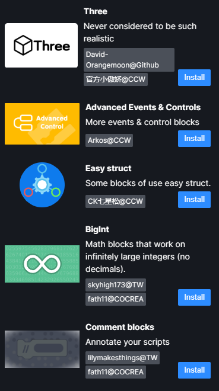

# 和 Gandi IDE 兼容

Gandi IDE 和 Turbowarp 的扩展并不如你想象那样十分不同；

因此，完全从零开始的教程并不是必要的。

但它们之间仍然有数个可能会导致不兼容的不同点，故在写扩展前请确保你读完整篇文档。

---

## 扩展信息 (又称元数据)

Gandi IDE 支持 `Scratch.extensions.register()`. 但它也有自己专属的元数据格式（如果没有这些元数据，你的代码就无法提交到 Gandi 仓库）。

若想要通过官方扩展加载器加载你的扩展，你需要提供以下信息：

```js
Reflect.set(window, 'tempExt', {
  Extension: YourExtensionClass, // 将它换成你的扩展类
  info: {
    name: 'NamespaceOfyourExtension.name', // 将 NamespaceOfyourExtension 换成你扩展的命名空间（通常是你扩展的名字，比如 lpp）。
    description: 'NamespaceOfyourExtension.desc',
    extensionId: 'NameOfyourExtension', // 扩展 ID。通常是你扩展的名字，但请只用字母（不要使用特殊符号或数字）。
    featured: true,
    disabled: false,
    collaborator: 'You!', // 将你的大名写在这！
    iconURL: 'https://example.com/icon.svg', // 你扩展的封面。
    insetIconURL: 'https://example.com/iconSmall.svg', // 你扩展的图标（将会在扩展积木的左侧显示）。
    collaboratorURL: 'https://github.com/FurryR', // 可选但是推荐指定。将它换成你的个人主页或博客网址。

    // 下列内容用于有多个创作者的情况。请不要同时使用 collaborator 和 collaboratorList！
    collaboratorList: [
      {
        collaborator: 'FurryR@GitHub',
        collaboratorURL: 'https://github.com/FurryR'
      },
      {
        collaborator: 'Fath11@Cocrea',
        collaboratorURL: 'https://cocrea.world/@Fath11'
      },
      {
        collaborator: 'VeroFess@GitHub',
        collaboratorURL: 'https://github.com/VeroFess'
      }
    ]
  },
  // CCW 不支持日语之类的语言，所以我们没必要为那些语言加翻译。
  l10n: {
    'zh-cn': {
      'NamespaceOfyourExtension.name': 'Wheeling', // 你扩展的简体中文名（很不幸我们没有繁体中文和日语）。同时请不要忘记替换 NamespaceOfyourExtension。
      'NamespaceOfyourExtension.desc':
        '💫 一个由社区创建的 Scratch 扩展开发教程。' // 用简短的简体中文描述你的扩展。
    },
    en: {
      'NamespaceOfyourExtension.name': 'Wheeling', // 你扩展的英文名。
      'NamespaceOfyourExtension.desc':
        '💫 a Scratch extension development documentation made by community.' // 用简短的英语描述你的扩展。
    }
  }
})
```

若你的扩展没有英语翻译则不会被合并，故请确保你认识一个翻译者，不然你就得自己翻译它了（请不要用谷歌翻译）。

这些信息将会用于显示类似于下方的扩展卡片。

<details>
<summary>Gandi 扩展卡片</summary>



</details>

---

## 运行时

Turbowarp 允许扩展通过 `Scratch.vm.runtime` 来访问运行时，而 Gandi IDE 要求你通过扩展类的构造器访问运行时。

```js
// ... 在你的扩展类中
class MyExtension {
  constructor(runtime) {
    this.runtime = runtime
  }
}
// 你现在可以用 this.runtime 来访问运行时了。
```

这里有一个确保兼容性的办法。

```js
if (Scratch.vm?.runtime) {
  Scratch.extensions.register(new YourExtension(Scratch.vm.runtime)) // 这是 Turbowarp 并且我们用 Scratch.extensions.register() 注册扩展。
} else {
  Reflect.set(window, 'tempExt', {}) // 这是 Gandi 并且我们使用 tempExt 注册扩展。
}
// 你现在就可以在 Turbowarp 和 Gandi 上通过 `this.runtime`（在你的扩展类实例中）访问运行时了。
```

---

## Scratch.vm

Gandi IDE 不允许你直接访问它的 Scratch 虚拟机实例（这样的限制没有意义）。

作为替代，我们需要一些破解补丁。这是来自 [lpp](github.com/FurryR/lpp-scratch) 的获取方法。

请注意在扩展的注释中加入一条关于 lpp 的信息（因为 lpp 是以 MIT 协议授权的）。

```js
function hijack(fn) {
  const _orig = Function.prototype.apply
  Function.prototype.apply = function (thisArg) {
    return thisArg
  }
  const result = fn()
  Function.prototype.apply = _orig
  return result
}
class MyExtension {
  constructor(runtime) {
    this.runtime = runtime
    if (this.runtime._events['QUESTION'] instanceof Array) {
      for (const value of this.runtime._events['QUESTION']) {
        const v = hijack(value)
        if (v?.props?.vm) {
          virtualMachine = v?.props?.vm
          break
        }
      }
    } else if (this.runtime._events['QUESTION']) {
      virtualMachine = hijack(this.runtime._events['QUESTION'])?.props?.vm
    }
    if (!virtualMachine)
      throw new Error('lpp cannot get Virtual Machine instance.')
    this.vm = virtualMachine
    // 现在你就可以通过 this.vm 访问虚拟机实例了。此方法在所有基于 Scratch 的平台（包括 Scratch 自己）上有效。
  }
}
```

---

## Scratch.Cast

~~在 Gandi，开发者们通常使用以下代码来使用 `Scratch.Cast` 方法：~~

```js
import Cast from '../utils/cast.js'
```

**别这样做。** 这样做会破坏与 Turbowarp 的兼容性，并且你还需要手动配置 `ES 模块支持` 来调试你的扩展。

他们使用 `import Cast from '../utils/cast.js'`，因为他们是菜鸟。

Gandi IDE **支持** 直接使用 `Scratch.Cast` 所以推荐这样做来确保兼容性。

~~但如果你想要一些其它 API，比如 `Color`，你必须从 `../utils/color.js` 手动导入它。~~

忘了这条吧。

你可以从 `../util/color.js` 复制代码（并放到你的文件中）或者用你自己的实现。导入 `../utils/color.js` 同样会破坏兼容性。

---

## Scratch.translate

你可以使用 `Scratch.translate()`。推荐在你的扩展中加入以下方法：

```js
formatMessage(id) {
    return Scratch.translate({
      id,
      default: id,
      description: id,
    })
  }
```

这样你就可以使用 `this.formatMessage()` 来代替 `Scratch.translate()`。

~~这是因为 Gandi 只能用 `runtime.getFormatMessage()` 并且你不能直接使用 `Scratch.translate()`。~~

Gandi IDE 现在支持了 `Scratch.translate()`。请使用 `Scratch.translate()` 并且不要使用 `runtime.getFormatMessage()`。

但是因为 `this.formatMessage()` 很方便，你仍然可以使用它（来将你的 Gandi 扩展移植到 Turbowarp）。

---

在未来，随着 Gandi IDE 更新，更多来自 Turbowarp 的功能将会实装进来。

对于现在来说，~~一些~~ **一大堆** Turbowarp 功能都不被支持。对于 Turbowarp 来说同样一堆 Gandi 功能也不被支持。

你得自寻出路来移植这些功能。

并且，Gandi 有它自己的私有 API （你在他官方仓库里找不到的那种），比如 `vm.runtime.runtimeOptions.hatsConcurrency` （这玩意修改了 `vm.runtime.startHats` 的行为，所以有些项目，尤其是用了自定义 hat 的，在 Gandi 上没办法正常跑起来）, `vm.runtime.scratchBlocks`, `VM.Target.isModule`, `vm.runtime.logSystem`, `vm.runtime.gandi`, 等等等等。

使用它们将会破坏与 Turbowarp 的兼容性，所以使用前请三思。
